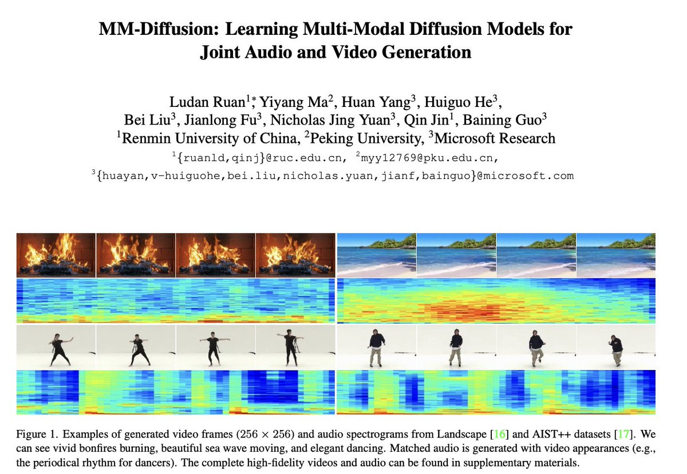
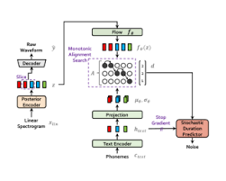

# AUDIO GENERATION WITH DIFFUSION MODELS

This repository is maintained by [**Carlos Hernández-Oliván**](https://carlosholivan.github.io/index.html)(carloshero@unizar.es) and it presents the State of the Art of Audio Generation with Diffusion models.

Make a pull request if you want to contribute to this references list.

All the images belong to their corresponding authors.

## Table of Contents
## 

1. [Papers](#papers)
    - [2022](#2022)
    - [2021](#2021)

2. [Diffusion theory papers](#theory)

3. [Resources](#resources)

## 1. Papers

### 2022

#### MM-Diffusion

Ruan, Ludan and Ma, Yiyang and Yang, Huan and He, Huiguo and Liu, Bei and Fu, Jianlong and Yuan, Nicholas Jing and Jin, Qin and Guo, Baining. (2022). MM-Diffusion: Learning Multi-Modal Diffusion Models for Joint Audio and Video Generation.

[Paper](https://arxiv.org/pdf/2212.09478v1.pdf) [GitHub](https://github.com/researchmm/MM-Diffusion)

### 2021

#### Diffwave (ICLR 2021)

Kong, Z., Ping, W., Huang, J., Zhao, K., & Catanzaro, B. (2020). Diffwave: A versatile diffusion model for audio synthesis. ICLR 2021.

[Paper](https://arxiv.org/pdf/2009.09761.pdf)

## 2. Theory

## 3. Resources

- [Lil's blog diffusion](https://lilianweng.github.io/posts/2021-07-11-diffusion-models/)

[&uarr; Table of Contents](#index)
